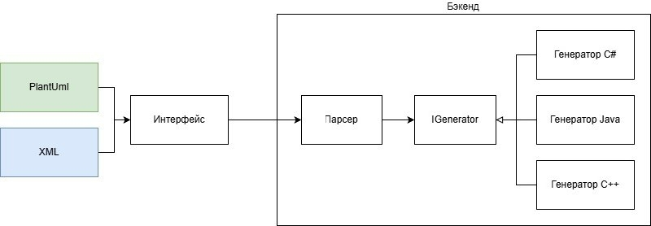

# UmlToCodeConverter

**UmlToCodeConverter** — это инструмент на C#, который преобразует диаграммы в формате **PlantUML** и **XML** в готовые классы для **Java**, **C#**, **Go** и других языков. Позволяет автоматически генерировать код по архитектурной модели и поддерживать синхронизацию между дизайном и реализацией.

## 🧩 Архитектура проекта

Ниже показана общая структура системы: от входных форматов до генерации кода для разных языков.



## 🚀 Возможности

- ✅ Парсинг **PlantUML** и **XML** диаграмм
- ✅ Генерация классов для **Java**, **C#**, **Go**
- ✅ Расширяемая архитектура — легко добавить новый язык
- ✅ Поддержка интерфейсов, наследования, типов свойств
- ✅ E2E-тесты для проверки целостности конвейера

## 🗂 Структура проекта

### 1. `Core` — Ядро конвертации

Самый важный модуль, отвечающий за всю логику преобразования.

**Основные компоненты:**

| Компонент               | Назначение |
|:------------------------| :--- |
| **Парсеры**             | Читают входные файлы (PlantUML, XML) и строят внутреннюю объектную модель классов, интерфейсов, свойств и методов. |
| **Внутренняя модель**   | Универсальное представление UML-сущностей, не зависящее от входного формата. |
| **IGenerator**          | Интерфейс, который реализуют все генераторы кода. |
| **Генераторы** | Реализации `IGenerator` для конкретных языков. Обходят внутреннюю модель и создают исходные файлы. |

### 2. `Presentation` — Пользовательский интерфейс

Модуль, предоставляющий графическую оболочку для ядра.

**Основные функции:**

| Функция               | Описание                                                                    |
|:----------------------|:----------------------------------------------------------------------------|
| **Выбор типа файла**  | Выбор UML-файла (PlantUML, XML) через радиокнопки или выпадающий список     |
| **Выбор языка**       | Выбор целевого языка (Java, C#, Go) через радиокнопки или выпадающий список |
| **Ввод UML/XML**      | Вставка UML/XML в соответствующее поле                                      |
| **Запуск**            | Кнопка "Сгенерировать", вызывающая методы из `Core`                         |
| **Предпросмотр кода** | Показ сгенерированного кода                                                 |

### 3. `Tests` — Тестирование

Модуль, отвечающий за unit-тесты и end-to-end-тесты.

| Тип тестов | Что проверяет | Примеры проверок                                                                                                                                                    |
| :--- | :--- |:--------------------------------------------------------------------------------------------------------------------------------------------------------------------|
| **Unit-тесты** | Отдельные компоненты изолированно | ✅ Корректность парсинга PlantUML-диаграммы (классы, методы, поля)<br>✅ Корректность парсинга XML-диаграммы<br>✅ Каждый генератор кода (Java, C#, Go) по отдельности |
| **E2E-тесты** (End-to-End) | Полный цикл: парсинг → кодогенерация | ✅ Парсинг PlantUML → генерация C#                                                                                                                                   |

## 📦 Начало работы

### Требования

- [.NET SDK](https://dotnet.microsoft.com/download) (версия 6.0 или выше)
- Git

### Установка и запуск

```bash
# Клонируйте репозиторий
git clone https://github.com/makeentosch/UmlToCodeConverter.git
cd UmlToCodeConverter

# Соберите решение
dotnet build

# Запустите тесты (опционально)
dotnet test