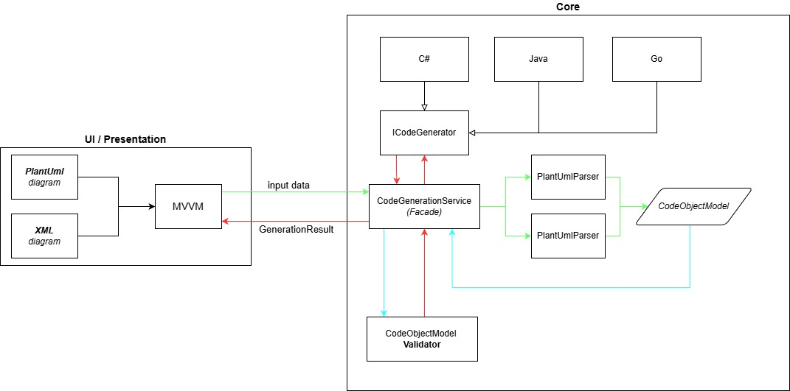

# UmlToCodeConverter

**UmlToCodeConverter** — это инструмент на C#, который преобразует абстрактные архитектурные модели в формате **PlantUML** и **XML** в готовые классы для **Java**, **C#**, **Go**. Приложение не только генерирует код, но и проводит строгую валидацию спроектированной архитектуры на соответствие правилам целевого языка (например, запрет множественного наследования классов в Java или C#).

## 🧩 Архитектура проекта

Ниже показана общая структура системы: от входных форматов до генерации кода для разных языков.

## 🚀 Возможности

- ✅ Парсинг **PlantUML** и предметно-ориентированного **XML**
- ✅ Строгая архитектурная валидация (проверка наследования, интерфейсов, перегрузок методов)
- ✅ Генерация чистого кода для **C#**, **Java**, **Go**
- ✅ Расширяемая многослойная архитектура (SOLID, паттерны: Стратегия, Фасад, Фабрика)
- ✅ Графический WPF-интерфейс (MVVM) с подсветкой синтаксиса
- ✅ Покрытие Unit- и E2E-тестами

## 📄 Формат входных данных

Приложение принимает на вход тексты в формате PlantUML, а также поддерживает работу с собственным XML-форматом.

**Характеристика XML-формата:**
Наше приложение работает со структурированным предметно-ориентированным XML-форматом (Domain-Specific XML). Концептуально он опирается на индустриальный стандарт **XMI (XML Metadata Interchange)**, но является его **упрощенным (lightweight) подмножеством**. 
Он адаптирован специально для кодогенерации: из него исключен весь избыточный синтаксис визуального форматирования (координаты блоков, цвета, размеры), оставлена только чистая объектно-ориентированная метамодель (классы, интерфейсы, методы, свойства и связи). Это делает формат строго декларативным — он описывает *что* из себя представляет система, а не *как* она нарисована.

## 🗂 Структура проекта

Проект спроектирован по принципам чистой архитектуры (Clean Architecture) и разделен на логические слои:

### 1. `Core` — Ядро и бизнес-логика

Самый важный модуль, не зависящий от графического интерфейса. Разделен на подсистемы:

| Подсистема / Слой | Назначение |
|:------------------| :--- |
| **Domain (Модель)** | Универсальное внутреннее представление UML-сущностей (AST), не зависящее от входного формата. |
| **Application (Сервисы)** | Фасад `CodeGenerationService`, оркестрирующий конвейер: *Парсинг → Валидация → Генерация*. |
| **Validation (Валидатор)** | Набор независимых правил (`IValidationRule`) для проверки архитектуры под конкретный язык программирования. |
| **Парсеры** | Реализации `IUmlParser`, читающие входные файлы и строящие внутреннюю модель `Domain`. |
| **Генераторы** | Реализации `ICodeGenerator` для конкретных языков (C#, Java, Go). |

### 2. `Presentation` — Пользовательский интерфейс

Графическая оболочка приложения, построенная на технологии WPF с использованием паттерна MVVM (Model-View-ViewModel).

| Компонент | Описание |
|:----------|:---------|
| **View (`MainWindow`)** | Декларативное описание интерфейса. Включает окна ввода, выбора языков и RichTextBox для вывода кода с динамической подсветкой синтаксиса. |
| **ViewModel (`MainViewModel`)** | Хранит состояние интерфейса и связывает действия пользователя с `CodeGenerationService` из слоя Application. Не содержит бизнес-логики. |

### 3. `Tests` — Тестирование

Модуль, обеспечивающий надежность и защиту от регрессий.

| Тип тестов | Что проверяет |
| :--- | :--- |
| **Unit-тесты** | Изолированная проверка логики: парсинг PlantUML/XML диаграмм, корректность генераторов кода и срабатывание конкретных правил валидации архитектуры. |
| **E2E-тесты** | Полный цикл: *Сырой текст → Парсинг → Валидация → Сгенерированный код*. |

## 📦 Начало работы

### Установка и запуск

Готовое к использованию приложение можно загрузить напрямую из репозитория:

1. Перейдите на страницу **[Releases](https://github.com/makeentosch/UmlToCodeConverter/releases)** в этом репозитории.
2. Скачайте архив с последней актуальной версией (`.zip`).
3. Распакуйте архив в любую удобную папку на вашем компьютере.
4. Запустите исполняемый файл `.exe`.

*Примечание: Для корректной работы приложения на вашем ПК должна быть установлена платформа [.NET Desktop Runtime](https://dotnet.microsoft.com/download) (версия 6.0 или выше).*
